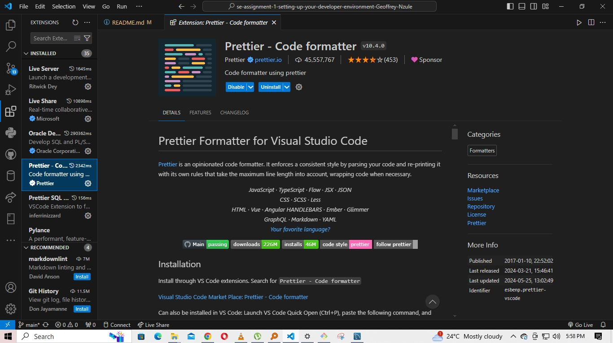
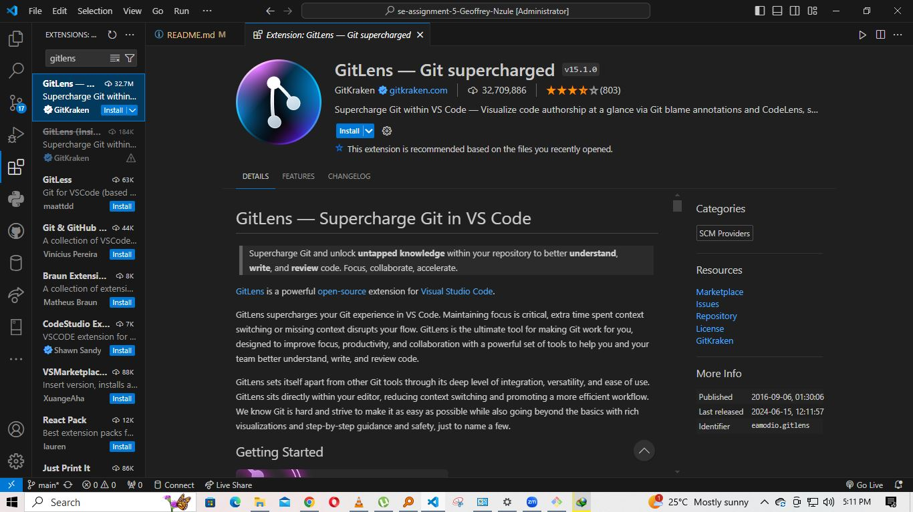
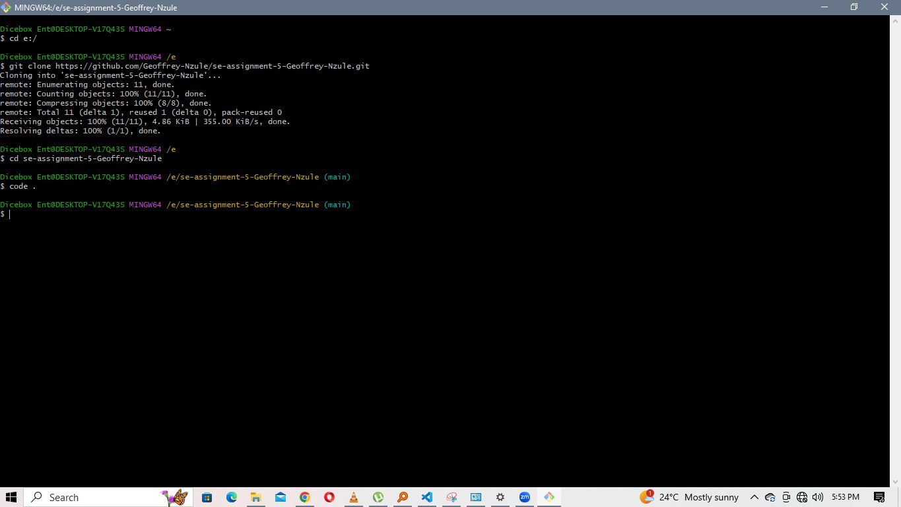
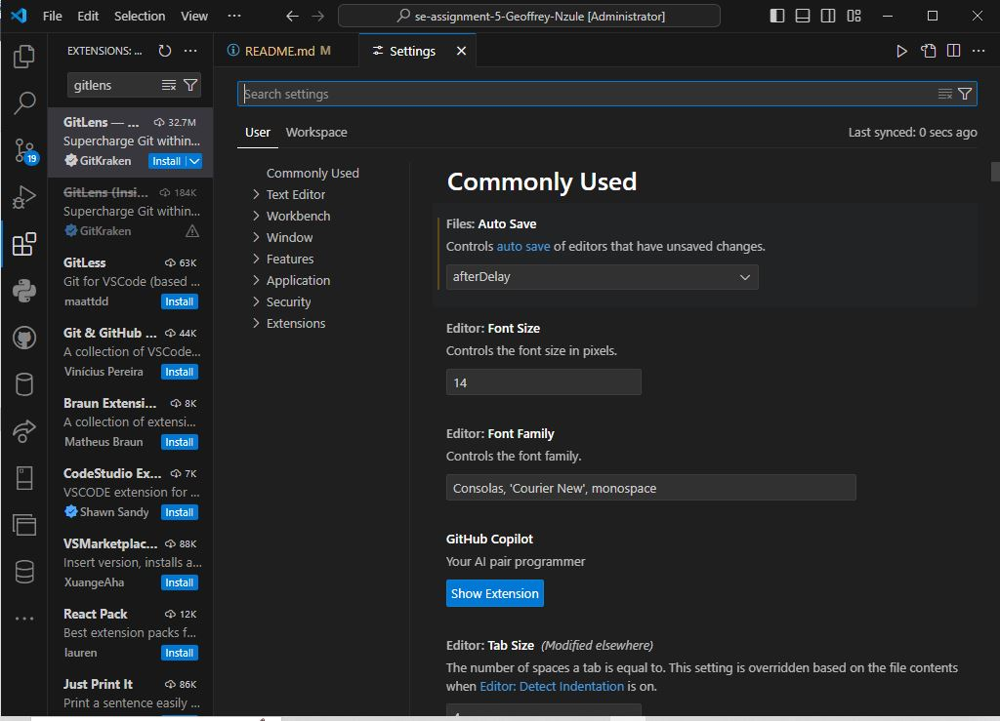
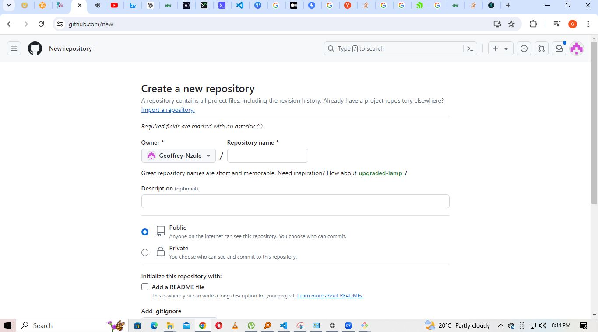
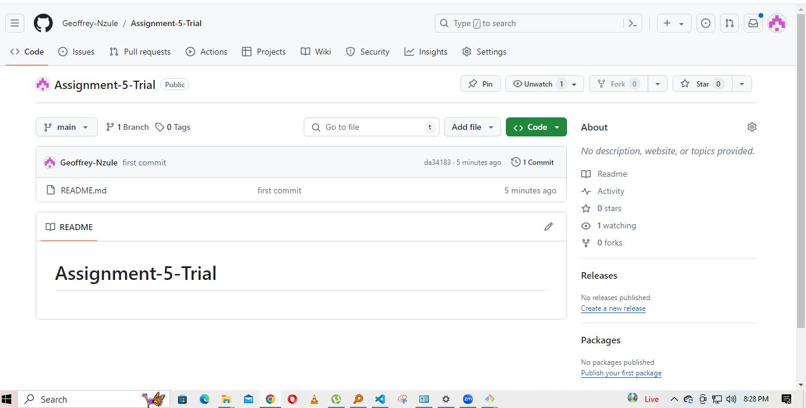

# SE-Assignment-5
Installation and Navigation of Visual Studio Code (VS Code)
 Instructions:
Answer the following questions based on your understanding of the installation and navigation of Visual Studio Code (VS Code). Provide detailed explanations and examples where appropriate.

 Questions:

1. Installation of VS Code:
   - Describe the steps to download and install Visual Studio Code on Windows 11 operating system. Include any prerequisites that might be needed.

 -visit the official website of the Visual Studio Code using any prefered web browser.

-press the download button for the prefered  dowwnload for either Windows, Linux or MacOs
- When the download is compleaded the Visual Studio Icon will appear in the download folder.

-After the installation,accept terms and condition of the Visual Studio Code.
-choose the location where the data running in the Visual Studio Code will be stored then click on the Next button.

-After pressing Next,Visual Studio Code will prompt you to begin the installation.

-It will take a minute or less to install the Visual Studio Code on your device.

 -After the installation, Launch the Visual Studio Code software and click Finish toggole.
 
 -After a successfull installation,the interface face of the Visual Studio Code will look as illustrated below. Now you will be able to code using your prefered coding language.
 

2. First-time Setup:
   - After installing VS Code, what initial configurations and settings should be adjusted for an optimal coding environment? Mention any important settings or extensions.

-After complete installation, you can either create a new file or open a folder where you would wish to start your project.Under the color theme you can select either light or dark mode as preference. some of the most important pluggings include live server extension which enables the user to have a view of the coded output. Another important extension is code runner for runing codes and pretter extension for code formating.

3. User Interface Overview:
   - Explain the main components of the VS Code user interface. Identify and describe the purpose of the Activity Bar, Side Bar, Editor Group, and Status Bar.
   -Visual Studio interface enables a user to have more interactions as compared to other text editors. The main regions found on the Visual Studio software interface includes; the activity bar, side bar, editor groups, the panel and the status bar.
   
   -The Activity Bar designated on the left side of the window, provides access to different tools within the VS Code with each tool representing different functionality.
   
   -Side Bar located on the right next to the Activity Bar, provides detailed interactions and views related to the chosen activity. ie run and debug, search, explorer and extensions.
   
   -Editor Group located at the center of the window. This where you write and edit your code.
   -Stutus Bar found at the bottom of the window main purpose is to display information of the editor current state and also the workspace. Some of the common elements include;encoding, indentation, language mode, line and column number and also not forgetting Git Branch and Status if the respository is under version control. 
   

4. Command Palette:
   - What is the Command Palette in VS Code, and how can it be accessed? Provide examples of common tasks that can be performed using the Command Palette.
   -The Command Palette in Visual Studio Code  is a useful tool that gives you fast access to various commands and functions without having to go through menus. It lets you easily execute commands, search for files, adjust settings, and more through a user-friendly interface.
   

   -Some of common tasks that can be performed using the command line include;
1.How to Open Files:

To quickly open a file by typing its name, use the command > Open File.
To open a file directly by name, use the command > Go to File... (Ctrl+P or Cmd+P).

2.Debugging:

To start a debugging session, click on Debug > Start Debugging.
To add or modify debug configurations, click on Debug > Add Configuration.

3.Terminal Operations:

Type > Terminal: Kill Terminal to close the active terminal.
Use > Terminal: Run Task to execute a predefined task.

4.Source Control:

Type > Git: Commit to commit changes in the source control.
Use > Git: Checkout to... to switch branches.

5. Extensions in VS Code:
   - Discuss the role of extensions in VS Code. How can users find, install, and manage extensions? Provide examples of essential extensions for web development.

-Visual Studio Code is known for its exception functionality which simplifies coding experience.They are many extensions with different functionality but will only give examples based on popular extensions.
1.prettier organizes code in a unique way making them to look neat thus making it easier to work on the project. The extension transforms the code to look good and easy to read.

2.Gitlens and Git Graph
-The program enbles multiple developers to work on the same project and also facilitates code sharing thus staying updated on any changes made by others.

3. Live Server offers live development server for web applications.It allows developers to instantly test their projects in a local environment with the ability to automatically refresh the browser. This feature makes it easy to see changes in real time hence make quick  modifications. 
 
6. Integrated Terminal:
   - Describe how to open and use the integrated terminal in VS Code. What are the advantages of using the integrated terminal compared to an external terminal?
   -The intergrated teminal allows a user to run command-line tasks directly within the editor. Using the terminal streamlines development workflow by keeping everything in one place thus enhancing productivity. some of the advantages of using Intergrated Terminal include;seamless workflow,customization and persistence, contextual relevance,synchronization with VS Code features, Multi-Root Workspaces and easy accessibility.
7. File and Folder Management:
   - Explain how to create, open, and manage files and folders in VS Code. How can users navigate between different files and directories efficiently? There are different ways of creating files and folders. One way is through the use of text editors such as Git bash,CMD or windows powershell. Through the mentioned text editors, one can open a directory by keying in text functions to facilitate the opening.
   
   Another way of opening new files and folders is through the VS Code through the file option and create your prefered preference.

8. Settings and Preferences:
   - Where can users find and customize settings in VS Code? Provide examples of how to change the theme, font size, and keybindings.
   -To be able to change the theme of the VS Code, you go under the file option-preferences-theme and from there you will be able to customize according to your preference.
   -Under file-preference-settings. You can custiomize the font according your  preferences.
   

9. Debugging in VS Code:
   - Outline the steps to set up and start debugging a simple program in VS Code.
    -Debugging a web application is vital to be able to identify and solve a problem which maybe present in the code or   external setup.
    One of the ways of debugging is by using Breakpoints which allow a user to pause an excution at a specific line of code.
   -Step by step debugging in VS Code allows a developer to attend to an error through code line-by-line.
   -Source Maps allows debuging in its original source file regardless if it has been modified.
   -AI debugging such as using Gemini AI and Chatgpt among others help in debugging and fixing the error.

   for instance, when debugging using Chatgtp, the user can load the error code in the site and thus the AI can debug and find the error and at the same time find a solution to the problem.

10. Using Source Control:
    - How can users integrate Git with VS Code for version control? Describe the process of initializing a repository, making commits, and pushing changes to GitHub.
    - First thing is to create a new repository in GitHub then copy the repository URL.
    

    Open the terminal or Gitbash.
    
    You should be in project path or a working directory.
   
    In the terminal or Gitbash, type git init to intialize git on the local directory.
   git add . to add your project.
   
    git commit -m "Your message".git branch -M main.

    git remote add origin.git push -u origin main
    

    -The project will be available on the repository and ready to be cloned in the local repository.
    

 Submission Guidelines:
- Your answers should be well-structured, concise, and to the point.
- Provide screenshots or step-by-step instructions where applicable.

- Cite any references or sources you use in your answers.

What is visual studio code? (no date) Educative. Available at: https://www.educative.io/answers/what-is-visual-studio-code (Accessed: 17 June 2024). 

VS code - how to get started (no date) How to install and get started with VS Code. Available at: https://www3.ntu.edu.sg/home/ehchua/programming/howto/VSCode_HowTo.html (Accessed: 17 June 2024). 

GeeksforGeeks (2024) How to install visual studio code on windows?, GeeksforGeeks. Available at: https://www.geeksforgeeks.org/how-to-install-visual-studio-code-on-windows/ (Accessed: 17 June 2024). 

Nitin (no date) 7 awesome vs code extensions you should try, Locofy Blogs. Available at: https://www.locofy.ai/blog/best-vs-code-extensions (Accessed: 17 June 2024). 

JMonJMon                      3 et al. (1965) Integrated Terminal in visual studio code is opening externally and not internally, Stack Overflow. Available at: https://stackoverflow.com/questions/58246717/integrated-terminal-in-visual-studio-code-is-opening-externally-and-not-internal (Accessed: 17 June 2024). 

- Submit your completed assignment by 1st July 

